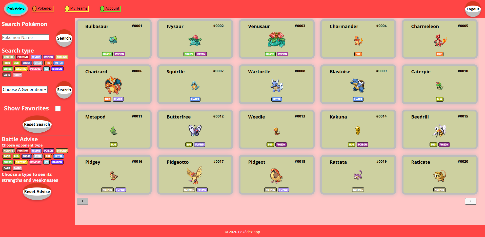

## Inhoudsopgave

---

1. Inleiding
2. Screenshot applicatie
3. Installatie
4. Account


# Inleiding

---

Ben jij net begonnen aan je nieuwe Pokémon avontuur maar word je overweldigd door de hoeveelheid Pokémon 
die er zijn? Jij bent niet de enige, de wereld van Pokémon is groot en daarom is de Pokédex in de wereld
geroepen om jonge trainers zoals jijzelf een handje te helpen. 

In de Pokédex kan je: 
- Pokémon zoeken m.b.v. filters.
- Battle advies opvragen over de sterktes en zwaktes van een specifiek type.
- Teams samenstellen zodat deze later gebruikt kunnen worden.

Het project is opgezet met Vite (React versie 19.2.6)
# Screenshot applicatie

---



# Installatie

---

We starten met het aanmaken van de database. Dit gaan we doen via de NOVI Dynamic API.
ga naar [NOVI Backend](https://novi-backend-api-wgsgz.ondigitalocean.app/) en als je deze nog niet hebt, maak een Project ID aan.
Als je een project ID hebt aangemaakt of al had gaan we de API configureren. vul hier jou Project ID in en
voeg bij bestand kiezen het meegestuurde Json bestand in genaamd "pokedexmdvr.json". Klik daarna op Upload API configuratie.
Als het succesvol geüpload is zal je hier bericht van krijgen. Wanneer dit niet werkt verwijs ik je graag naar de documentatie.

Nu de backend goed ingesteld staat kan je het project van github gaan clonen naar jouw IDE.
Als je het project gecloned hebt naar jouw locale machine installeer je eerst alle dependencies door 
het volgende commando in de terminal te runnen:
```shell
npm install
```

Nu gaan we de API keys instellen. 
- Maak hiervoor in de Rootmap een `.env` en een `.env.dist` bestand aan
- Voeg het woord `.env` toe aan het `.gitignore` bestand
- Zet in het `.env.dist` bestand `VITE_API_KEY=`
- Zet dit ook in het `.env` bestand
- run het commando `npm run build` in de terminal
- zet nu de volgende API keys (deze zijn ook te vinden op [PokeApi](https://pokeapi.co/)) in het `.env` bestand 
  - `VITE_API_BASE_URL=https://pokeapi.co/api/v2`
  - `VITE_API_POKEMON=https://pokeapi.co/api/v2/pokemon/`
  - `VITE_API_TYPE=https://pokeapi.co/api/v2/type/`
  - `VITE_API_GEN=https://pokeapi.co/api/v2/generation/`
  - `VITE_NOVI_API=https://novi-backend-api-wgsgz.ondigitalocean.app/api/`
  - `VITE_NOVI_PROJECT_ID=zet hier je eigen Novi project ID`

Nu de API keys ingesteld staan, gaan we nog de extra NPM-packages toevoegen.
Dit zijn de volgende command's:
- `npm install react-router-dom`
- `npm install jwt-decode`
- `npm install axios`
- `npm i react-icons`

Nu ben je klaar je project te starten. Type het volgende in je terminal
```shell
npm run dev
```
Open http://localhost:5173/ in je webbrowser om de pagina te bekijken.

# Account

---

het volgende account is al beschikbaar in de backend

| Email                 | Wachtwoord  |
|-----------------------|-------------|
| Maxdevries@gmail.com  | Test123     |


